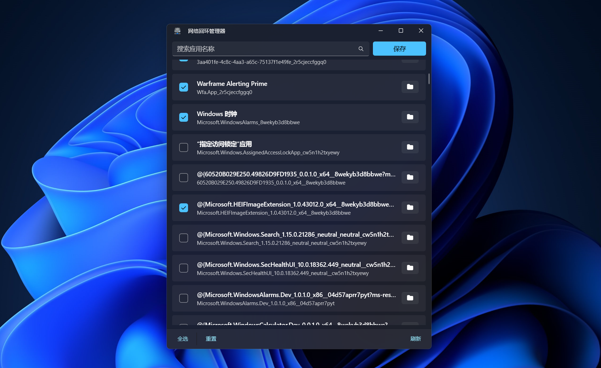

# 网络回环管理器

    

Windows 11 的本地网络回环管理器

[English](README_EN.md)

---

`网络回环管理器` 是一个管理当前设备上所有应用的本地网络回环的小工具

## ❓这是干什么的？

说本地网络回环你可能有些陌生，但是谈到 `127.0.0.1`，或者 `localhost` 你也许会更熟悉，这个就是本地回环地址。

对于很多用户（特别是中国大陆用户），翻墙设置网络代理是一种很常见的操作，甚至你自己可能都没意识到。而大多数代理就是走的本地代理，但是很多时候即便你在系统中使用了代理，部分应用依然无法翻墙甚至干脆无法连接网络，这就是这些应用没有启用本地网络回环功能。

**特别是 UWP 应用，默认就是关闭网络回环的**。

这个工具就是用来处理这个事情的，打开它，勾选上所有你要启用本地网络回环的应用，点击保存，这些应用就都可以走本地代理了，操作非常方便。

## 🔆 特别说明

项目核心代码参考 [Windows-Loopback-Exemption-Manager](https://github.com/tiagonmas/Windows-Loopback-Exemption-Manager)，你可以将本项目视作 `Windows-Loopback-Exemption-Manager` 的 Windows 11 版本（虽然 Package 大了亿点点）。

## 🙌 简单的开始

> **商店版本** 和 **侧加载版本** 可以共存

### 从商店安装

将链接 `ms-windows-store://pdp/?productid=9NTJ6CX698CL` 复制到浏览器地址栏打开，从 Microsoft Store 获取。获取后会永久保留在你的 Microsoft 账户下，可以通过 Store 进行下载加速与静默更新。

商店版本仅支持 Windows 11 及以上的系统。

### 侧加载 (Sideload)

如果你想本地安装网络回环管理器，请打开右侧的 [Release](https://github.com/Richasy/LoopbackManager.Desktop/releases) 页面，找到最新版本，并选择适用于当前系统的安装包下载。

*目前仅提供 x64 安装包，对于 ARM64 设备，Win11 可以直接安装 X64 的包*

然后打开 [系统设置](ms-settings:developers)，打开 `开发者模式` ，并等待系统安装一些必要的扩展项。

在应用压缩包下载完成后，解压压缩包，并在管理员模式下，使用 **Windows PowerShell** *(不是PowerShell Core)* 运行解压后的 `install.ps1` 脚本，根据提示进行安装。

## 🎖️ 鸣谢

- [Windows-Loopback-Exemption-Manager](https://github.com/tiagonmas/Windows-Loopback-Exemption-Manager)
- [Windows App SDK](https://github.com/microsoft/WindowsAppSDK)

## 🧩 截图

