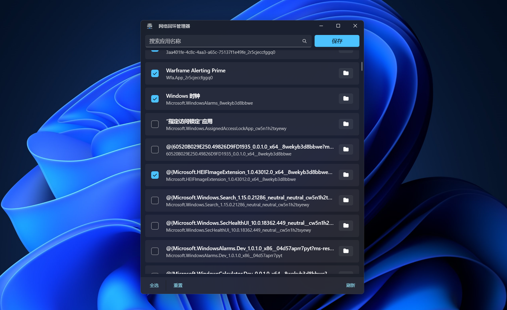

# 网络回环管理器

    

Windows 11 的本地网络回环管理器

[English](README_EN.md)

---

`网络回环管理器` 是一个管理当前设备上所有应用本地网络回环权限的小工具。

> [!IMPORTANT]
> 当前版本是基于自有原生 UI 框架 [Sprout](https://github.com/Richasy/Sprout) 重写的实验版本，**不使用
> WinUI**。Sprout 仍处于快速迭代阶段，因此界面、交互和兼容性可能继续调整。此前的 WinUI 实现保留在
> [`legacy`](https://github.com/Richasy/LoopbackManager.Desktop/tree/legacy) 分支。

## ❓这是干什么的？

说本地网络回环你可能有些陌生，但是谈到 `127.0.0.1`，或者 `localhost` 你也许会更熟悉，这个就是本地回环地址。

对于很多用户，设置网络代理是一种很常见的操作。大多数代理会在本机监听端口，但部分应用即使启用了系统代理也可能无法连接，因为这些应用没有启用本地网络回环。

**特别是 UWP 应用，默认就是关闭网络回环的**。

打开本工具，勾选需要启用本地网络回环的应用并点击 **保存**，这些应用即可访问本机代理服务。

## 🔆 特别说明

项目核心逻辑参考
[Windows-Loopback-Exemption-Manager](https://github.com/tiagonmas/Windows-Loopback-Exemption-Manager)。

当前应用界面由 Sprout 自绘并通过 Direct2D/DirectComposition 呈现；仓库的 `main` 分支不包含 WinUI
应用项目。Windows App SDK 仅用于非 UI 的平台能力与打包支持。

## 🙌 简单的开始

> **商店版本** 和 **侧加载版本** 使用不同身份，可以共存。

### 从商店安装

将链接 `ms-windows-store://pdp/?productid=9NTJ6CX698CL` 复制到浏览器地址栏打开，从 Microsoft Store 获取。获取后会永久保留在你的 Microsoft 账户下，可以通过 Store 进行下载加速与静默更新。

商店版本仅支持 Windows 11 及以上的系统。

### 侧加载 (Sideload)

从 [Releases](https://github.com/Richasy/LoopbackManager.Desktop/releases) 下载最新的 `.7z` 文件并解压，其中包含：

- `LoopbackManager.Shell.cer`：开发签名证书；
- `LoopbackManager.Shell_<version>_x64_arm64.msixbundle`：同时包含 x64 与 ARM64 的安装包。

首次安装时，先将 `.cer` 导入本地计算机的 **受信任人** 与 **受信任的根证书颁发机构**，再双击
`.msixbundle` 安装。该证书仅用于实验版侧载；Microsoft Store 版本由商店签名，无需手动安装证书。

## 🎖️ 鸣谢

- [Windows-Loopback-Exemption-Manager](https://github.com/tiagonmas/Windows-Loopback-Exemption-Manager)
- [Sprout](https://github.com/Richasy/Sprout)
- [Windows App SDK](https://github.com/microsoft/WindowsAppSDK)

## 🧩 截图

