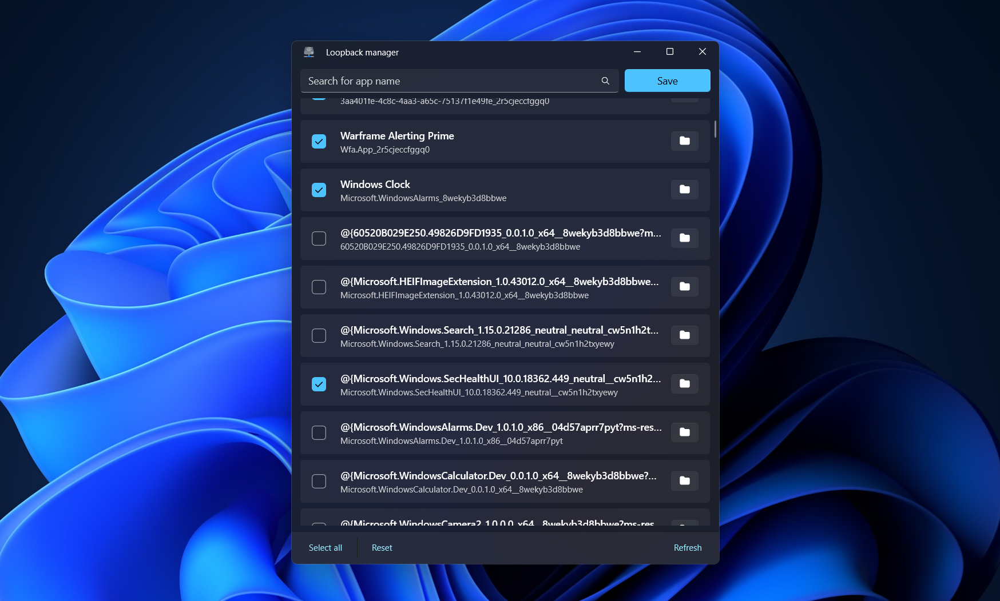

# Loopback Manager

    

Local Network Loopback Manager for Windows 11

[简体中文](README.md)

---

`Loopback Manager` is a small tool to manage the local network loopback of all applications on the current device

## ❓What's this?

You may be unfamiliar with the local network loopback, but you may be more familiar with `127.0.0.1` or `localhost`, which is the local loopback address.

For many users, setting up a network proxy is a very common operation, and you may not even realize it yourself. Most of the proxies are local proxies, but in many cases, even if you use proxies in the system, some applications still cannot connect to the network. This is because these applications do not enable the local network loopback function.

**Especially for UWP applications, the default is to turn off network loopback**。

This tool is used to handle this matter, open it, check all the applications you want to enable the local network loopback, click **Save**, these applications can go to the local proxy, the operation is very convenient.

## 🔆 Special note

Project core code reference [Windows-Loopback-Exemption-Manager](https://github.com/tiagonmas/Windows-Loopback-Exemption-Manager), You can think of this project as a Windows 11 version of `Windows-Loopback-Exemption-Manager` (although the Package is 'a little bigger').

## 🙌 Easy start

> **Store Version** and **Sideload Version** can coexist

### Install from Microsoft Store

Copy the link `ms-windows-store://pdp/?productid=9NTJ6CX698CL` to the browser address bar to open it and get it from the Microsoft Store. After you get it, it will remain permanently under your Microsoft account, and you can download accelerated and silent updates through the Store.

The store version only supports Windows 11 and above.

### Sideload

If you want to install the network loopback manager locally, please open the [Release](https://github.com/Richasy/LoopbackManager.Desktop/releases) on the right, Find the latest version and select the installation package for the current system to download。

*Currently only x64 packages are provided, for ARM64 devices, Win11 can directly install X64 packages*

Then open [System Settings](ms-settings:developers)，Turn on `Developer mode` and wait for the system to install some necessary extensions.

After the application package is downloaded, unzip the package, and in administrator mode, use **Windows PowerShell** *(not PowerShell Core)* to run the unzipped `install.ps1` script, and follow the prompts to install.

## 🎖️ Thanks

- [Windows-Loopback-Exemption-Manager](https://github.com/tiagonmas/Windows-Loopback-Exemption-Manager)
- [Windows App SDK](https://github.com/microsoft/WindowsAppSDK)

## 🧩 Screenshot

