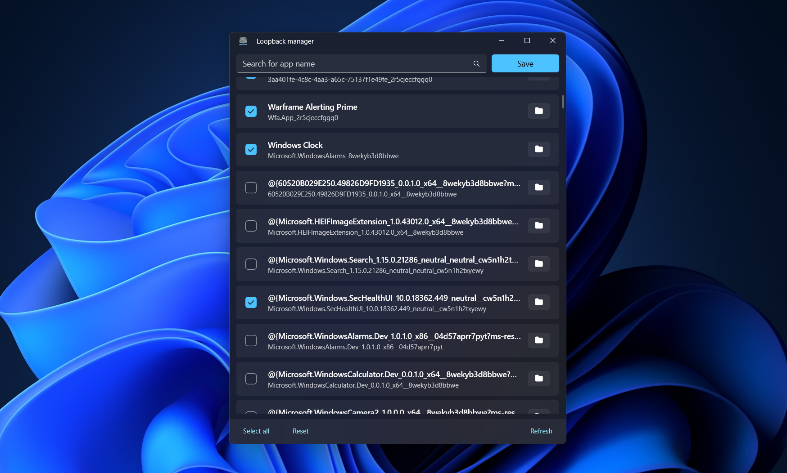

# Loopback Manager

    

Local Network Loopback Manager for Windows 11

[简体中文](README.md)

---

`Loopback Manager` is a small utility for managing local-network loopback exemptions for applications on the current
device.

> [!IMPORTANT]
> The current version is an experimental rewrite built with the self-owned native UI framework
> [Sprout](https://github.com/Richasy/Sprout). It **does not use WinUI**. Sprout is evolving quickly, so UI behavior,
> interaction details, and compatibility may continue to change. The previous WinUI implementation remains available
> on the [`legacy`](https://github.com/Richasy/LoopbackManager.Desktop/tree/legacy) branch.

## ❓What's this?

You may be unfamiliar with the local network loopback, but you may be more familiar with `127.0.0.1` or `localhost`, which is the local loopback address.

Many network proxies listen on a local port. Some applications may still fail to connect even when a system proxy is
configured because they have not been granted a local-network loopback exemption.

**Especially for UWP applications, the default is to turn off network loopback**。

Open this tool, select the applications that need local-network loopback, and click **Save**. Those applications can
then access locally hosted proxy services.

## 🔆 Special note

The core loopback logic references
[Windows-Loopback-Exemption-Manager](https://github.com/tiagonmas/Windows-Loopback-Exemption-Manager).

The current UI is self-drawn by Sprout and presented through Direct2D/DirectComposition. The repository's `main`
branch contains no WinUI application project. Windows App SDK is used only for non-UI platform capabilities and
packaging support.

## 🙌 Easy start

> The **Store version** and **sideload version** use different identities and can coexist.

### Install from Microsoft Store

Copy the link `ms-windows-store://pdp/?productid=9NTJ6CX698CL` to the browser address bar to open it and get it from the Microsoft Store. After you get it, it will remain permanently under your Microsoft account, and you can download accelerated and silent updates through the Store.

The store version only supports Windows 11 and above.

### Sideload

Download and extract the latest `.7z` archive from
[Releases](https://github.com/Richasy/LoopbackManager.Desktop/releases). It contains:

- `LoopbackManager.Shell.cer`: the development signing certificate;
- `LoopbackManager.Shell_<version>_x64_arm64.msixbundle`: one installer containing both x64 and ARM64 packages.

Before the first install, import the `.cer` into the local machine's **Trusted People** and **Trusted Root
Certification Authorities** stores, then open the `.msixbundle`. This certificate is only for the experimental
sideload build; Microsoft Store builds are signed by the Store and require no manual certificate installation.

## 🎖️ Thanks

- [Windows-Loopback-Exemption-Manager](https://github.com/tiagonmas/Windows-Loopback-Exemption-Manager)
- [Sprout](https://github.com/Richasy/Sprout)
- [Windows App SDK](https://github.com/microsoft/WindowsAppSDK)

## 🧩 Screenshot

